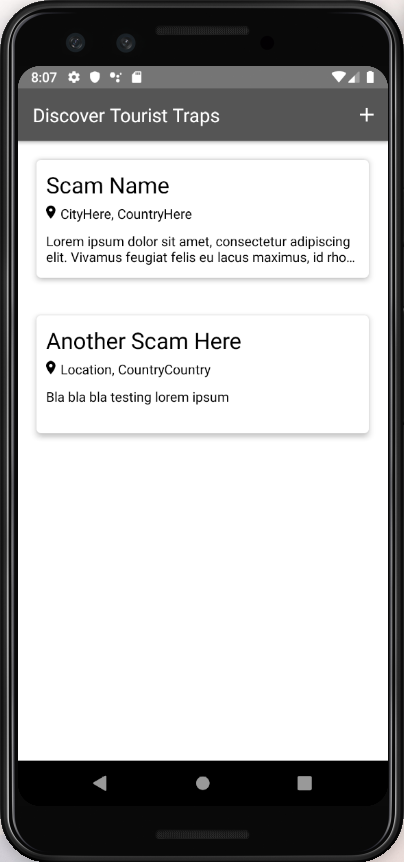
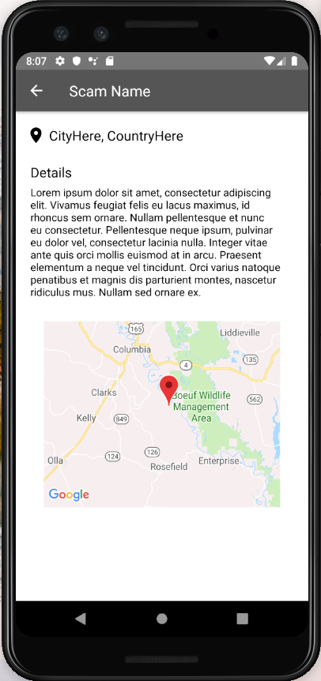
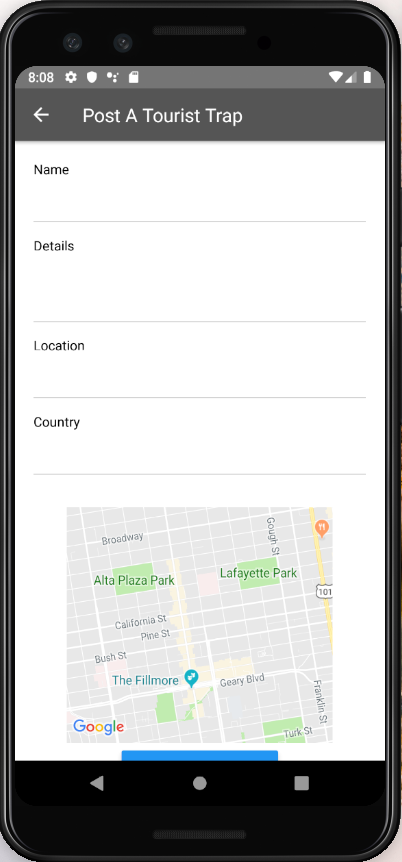

### CityGuide

An application that people can use to view and be wary of tourist
traps in different cities so that they can avoid them in the future.
The application lets people discover tourist traps in the main screen
and can click each one for more detail. When clicked it will also
display the location of the tourist trap on Google Maps along with a marker.

Users can also post tourist traps that they would like other users to be aware of.

